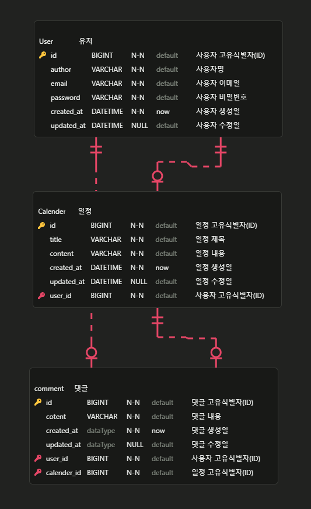

# 프로젝트 정보

- 개발기간: 2026.02.10 ~ 2026.02.12
- 리팩토링 목적: 기존에 있던 캘린더 프로젝트를 

---

## 프로젝트 소개
기존에 작성자별 일정을 생성/조회/수정/삭제 하는 기능에서 리팩토링하여 유저/일정/댓글을 나누어 연관 관계를 맺고 각 엔티티마다 CRUD 기능을 제공하는 배엔드 일정 관리 시스템으로 리팩토링하였습니다.

## 프로젝트 목적
- Cookie/Session 이해
- 연관 관계 학습
- Bean Validation
- 암호화 학습

## API 명세서
[API명세서 바로가기]()

## ERD

## TIL & 트러블 슈팅
[티스토리 바로가기]()